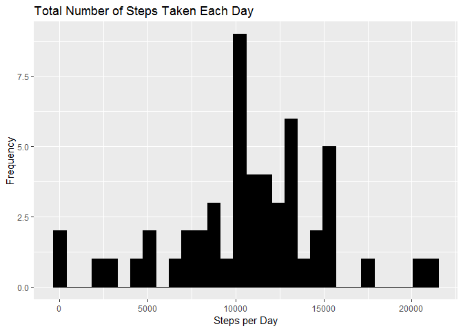
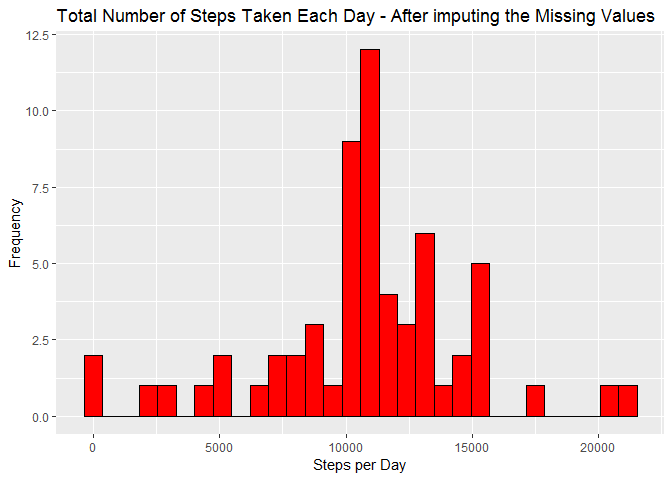

## Loading libraries and data

```r
  library(ggplot2)
```

```
## Warning: package 'ggplot2' was built under R version 3.5.2
```

```r
  library(dplyr)
```

```
## 
## Attaching package: 'dplyr'
```

```
## The following objects are masked from 'package:stats':
## 
##     filter, lag
```

```
## The following objects are masked from 'package:base':
## 
##     intersect, setdiff, setequal, union
```

```r
  setwd("E:/03.Yue/coursera/data science/course5/week2/")
  data <- read.csv("activity.csv")
```

## Q1: What is mean total number of steps taken per day?

```r
  total_steps <- data %>% group_by(date) %>% summarise(Steps = sum(steps))
  ggplot(data = total_steps, mapping = aes(x = Steps)) + 
        geom_histogram(fill = "black", colour = "black") + scale_x_continuous("Steps per Day") +                 
        scale_y_continuous("Frequency") + ggtitle("Total Number of Steps Taken Each Day")
```

```
## `stat_bin()` using `bins = 30`. Pick better value with `binwidth`.
```

```
## Warning: Removed 8 rows containing non-finite values (stat_bin).
```

<!-- -->

```r
  mean(total_steps$Steps, na.rm=TRUE)
```

```
## [1] 10766.19
```

```r
  median(total_steps$Steps, na.rm=TRUE)
```

```
## [1] 10765
```

## Q2: What is the average daily activity pattern?

```r
  actInterval <- data %>% group_by(interval) %>% summarise(meanSteps = mean(steps, na.rm = TRUE))
  ggplot(data = actInterval, mapping = aes(x = interval, y = meanSteps)) + 
        geom_line() + scale_x_continuous("Day Interval", breaks = seq(min(actInterval$interval), max(actInterval$interval), 200)) +
        scale_y_continuous("Average Number of Steps") + ggtitle("Average Number of Steps Taken by Interval")
```

<!-- -->

```r
  m=which.max(actInterval$meanSteps)
  actInterval$interval[m]
```

```
## [1] 835
```
Interval 835 contains the maximum number of step among the 5-minute intervals

## Q3: Imputing missing values

```r
  missing=subset(data,is.na(steps)==TRUE)
  nrow(missing)
```

```
## [1] 2304
```
The dataset contains 2304 rows with missing values (coded as NA).


All missing values are filled with mean value for that 5-minute interval.

```r
  # First merge the original data with the mean by interval
  actDat <- data %>% left_join(actInterval, by = "interval")
  # Next create a new column by replacing the missing data with the mean
  actDat$fillSteps <- ifelse(is.na(actDat$steps), actDat$meanSteps, actDat$steps)
  # Next drop the "steps" column and the "meanSteps" column, rename the "fillSteps" column to "steps"
  data2 <- subset(actDat,select=c(fillSteps,date,interval))
  colnames(data2) <- c("steps", "date", "interval")
```

Let's make a histogram of the total steps taken each day and calculate the mean and median.

```r
  total_steps2 <- data2 %>% group_by(date) %>% summarise(Steps = sum(steps))
  ggplot(data = total_steps2, mapping = aes(x = Steps)) + geom_histogram(fill = "red", colour = "black") + 
        scale_x_continuous("Steps per Day") + scale_y_continuous("Frequency") + 
        ggtitle("Total Number of Steps Taken Each Day - After imputing the Missing Values")
```

```
## `stat_bin()` using `bins = 30`. Pick better value with `binwidth`.
```

<!-- -->

```r
  mean(total_steps2$Steps, na.rm=TRUE)
```

```
## [1] 10766.19
```

```r
  median(total_steps2$Steps, na.rm=TRUE)
```

```
## [1] 10766.19
```
The mean and median are almost the same. Before imputation the mean is slightly higher than the median (10766.19 Vs 10765). The peak of the histogram shifts slightly to the left, and the histogram becomes more symmetric.

## Q4. Are there differences in activity patterns between weekdays and weekends?

```r
  weekday_weekend <- function(date) {
    day <- weekdays(date)
    if (day %in% c("Monday", "Tuesday", "Wednesday", "Thursday", "Friday"))
      return("weekday")
    else if (day %in% c("Saturday", "Sunday"))
      return("weekend")
    else
      stop("invalid date")
  }
  data2$date <- as.Date(data2$date)
  data2$day <- sapply(data2$date, FUN=weekday_weekend)
  averages <- aggregate(steps ~ interval + day, data=data2, mean)
  ggplot(averages, aes(interval, steps)) + geom_line() + facet_grid(day ~ .) + xlab("5-minute interval") + ylab("Number of steps")
```

<!-- -->

Yes, it seems there are two major differences between weekdays and weekends. 
(1) People tend to wake up later on weekends, so the steps don't grow as fast as on weekdays for the early intervals. 
(2) The steps of the intervals after the first peak is bigger on weekends than weekdays. Because on weekends people can do a lot of acitivities such as workout, sports or shipping, but on weekdays people can spend more time in the office, so the steps are lower. 
